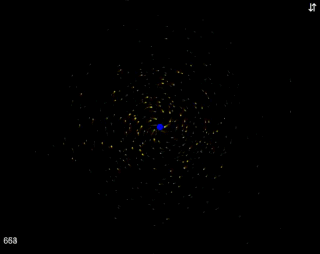

Gravity
======================

An experiment on [Processing.js](http://processingjs.org/), simulating universal gravitation in a simple fashion.

Uses parts of ES6, so might not work on all browsers (yet).

License: [MIT](LICENSE)

## Live demo

Click on the GIF

## To Do

☑ Parameters for the system

☑ UI for parameters

☑ Collision repositioning (jagged collisions bug)

☑ Collision radius based on mass

☑ Option: draw paths - click a part to get its path drawn!

☑ Proto disk through Gaussian distribution

☐ Zoomable canvas

☐ Save/load system
